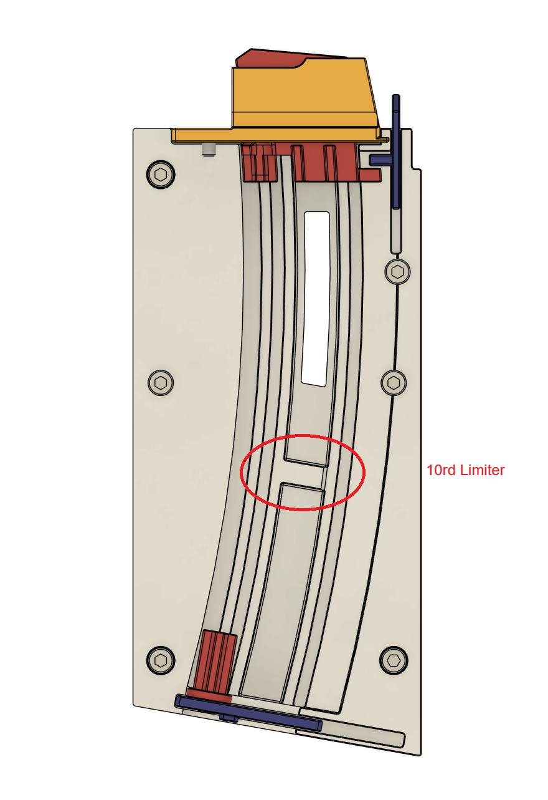

# Open Kriss DMK22C Magazine - 3D printable 22 AR Magazine

The magazine is designed to recreate the Kriss DMK22C 10/15 round magazine with all 3d printable parts while still preserving last round hold open feature. The feed lip and the follower are designed to be field replacable if they worn out. 

## BOM

* 1x Kriss DMK22C 10/15 magazine spring (dimension to be given later if you want to source the spring yourself)
* 6x M3x18 SHCS
* 2x M3x6 FHCS (CSK)
* 8x M3x5x4 Heatset Insert. 

## Limiter

> **Disclaimer:** I'm not responsible for any illegal modification to the 10 round limiter judged by your local laws and regulations. 

The built-in limiter will keep the maximum capacity to 10 rounds only. I will not provide the STL or source code to extend the design to hold more than my legal limits. 

