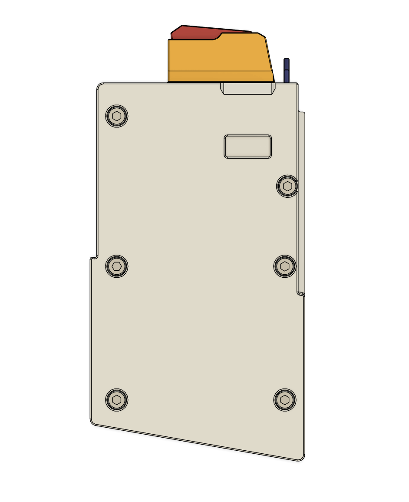

# Open Kriss DMK22C Magazine - 3D printable 22 AR Magazine

The magazine is designed to recreate the Kriss DMK22C 10 round magazine with all 3d printable parts while still preserving last round hold open feature. The feed lip and the follower are designed to be field replacable if they worn out. 

I will add design of 10/15 and 10/25 magazine support in the future. 

## BOM

* 1x Kriss DMK22C 10/15 magazine spring (0.6mm WD, 9mm OD, 250mm in Length)
* 6x M3x18 SHCS
* 2x M3x6 FHCS (CSK)
* 8x M3x5x4 Heatset Insert. 

## Print Settings

* Main Material: Any, except for abrasive CF/GF infused materials. 
* 0.2mm layer height.
* 4x walls
* 5x tops and bottoms layers.
* 0.4~0.45mm line width
* 15% infill.
